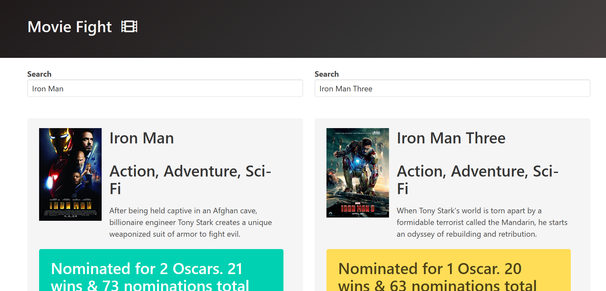

# Movie Fight

> Website where you can compare your favorite movies.

## Built With

- HTML & CSS
- JavaScript
- [OMDb API](https://www.omdbapi.com/)

## Live Demo

[Live Demo Link]( https://wes-isaac.github.io/movieFight/)

## Getting Started

To get a local copy up and running follow these simple example steps.

- go to the directory that you want to clone the repository in.
- right click and choose Git Bash here.
- type "git clone https://github.com/Wes-Isaac/movieFight.git".

## Authors

👤 **Yishak**

- GitHub: [Yishak ,Wes-Isaac](https://github.com/Wes-Isaac)
- LinkedIn: [@Yishak](https://www.linkedin.com/in/yishak-wesego-b404851a7/)

## 🤝 Contributing

Contributions, issues, and feature requests are welcome!

Feel free to check the [issues page](../../issues/).

## Show your support

Give a ⭐️ if you like this project!

## Acknowledgments

- Colt Steele for his tutorial on JavaScript.

## 📝 License

This project is [MIT](./MIT.md) licensed.
